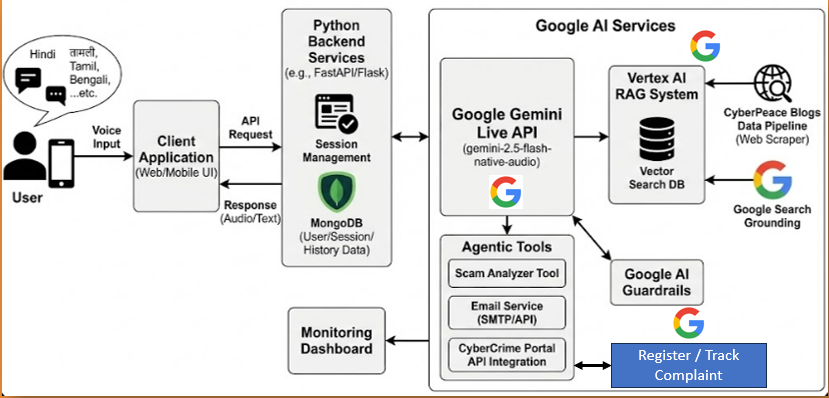
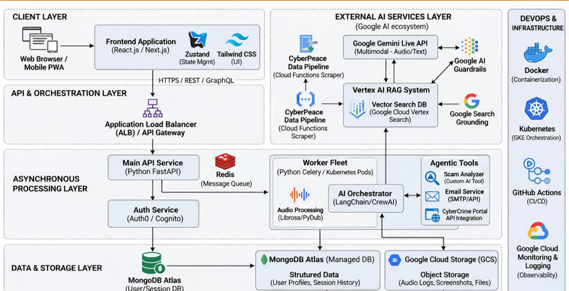

# 🛡️ CyberPeace SAATHI 🤖
**An AI-Powered Platform for Real-Time Cybersecurity Awareness & Legal Guidance**

[](LICENSE)
[](https://github.com/TechSavvyLibra/cyberpeace-SAATHI/stargazers)
[](https://github.com/TechSavvyLibra/cyberpeace-SAATHI/issues)

---

## 🚀 Overview
**CyberPeace SAATHI** is a GenAI-based platform designed to bridge the digital literacy gap for non-technical users, including children, teenagers, and the elderly.

### **The Problem**
The rapid rise in cybercrime often leaves vulnerable populations behind due to the complexity of technical warnings and legal procedures.

### **The Solution**
SAATHI provides real-time alerts, simplified IT law explanations, and an intuitive AI interface to empower users to navigate the digital world safely.

---

## ✨ Key Features
- **Real-Time Alerts:** Scrapes and summarizes cybersecurity news from trusted sources.
- **Simplified Legal Info:** Breaks down IT laws and remedies into plain language.
- **AI-Powered Assistance:** An intuitive interface for resolving cybersecurity queries.
- **News Monitoring:** Uses NLP techniques for relevance filtering of global cyber updates.
- **Victim Empowerment:** Guided steps on how to report and respond to cybercrimes.

---

## 🏗️ System Architecture
The platform is built on a modular architecture to ensure scalability, real-time data processing, and high-accuracy information retrieval.

### **1. High-Level Design**
The overall flow from data ingestion to user interaction.


### **2. Detailed Component Workflow**
Detailed view of the GenAI and RAG pipeline.


---

## 🛠️ Tech Stack
- **Frontend:** React.js / Next.js (Modern & Responsive UI)
- **AI/ML:** NLP, Retrieval-Augmented Generation (RAG), LLMs
- **Automation:** Web Scraping (Selenium/BeautifulSoup)
- **Backend:** Node.js / Python (FastAPI/Flask)
- **Database:** Vector Database (for RAG context)

---

## 📦 Installation & Setup

1. **Clone the Repository:**
   ```bash
   git clone [https://github.com/TechSavvyLibra/cyberpeace-SAATHI.git](https://github.com/TechSavvyLibra/cyberpeace-SAATHI.git)
   cd cyberpeace-SAATHI

   npm install  # or pip install -r requirements.txt

   npm run dev
